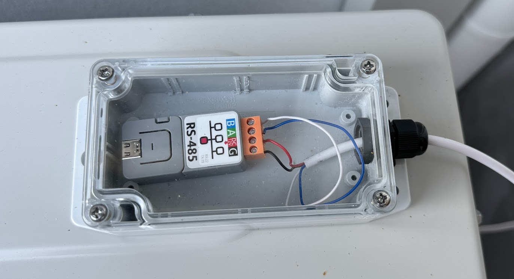

# esphome-lgap

**Note: This integration works with LG Outdoor Units (ODUs/inverters). If your ODU doesn't have an LGAP/Central Control interface or integration through a board such as the LG PI-485 board, or you're looking to integrate with the indoor wall panel controller instead, check out: [JanM321/esphome-lg-controller](https://github.com/JanM321/esphome-lg-controller).**


**esphome-lgap** is an implementation of the LG Aircon Protocol (LGAP) implemented as an [esphome](https://esphome.io/) component. This enables you to use an ESP8266/ESP32 to interface directly on the interface generally used for building management system integration/control of LG HVAC units. 

One of the best benefits of using this integration is you can use a single LGAP interface on your outdoor unit (ODU) to drive multiple different indoor unit (IDU) zones.


## Table of Contents

* [Project background](./background.md)
* [LGAP protocol detail](./protocol.md)
* Build instructions (below)


## Build intructions

### Disclaimer
This whole exercise has been for my own personal learning and experimentation. There are aspects of integrating with high voltage equipment and looking into unpublished protocols. Attempting anything detailed here is at your own risk, may void the warranty of your unit or worse may result in physical harm.

I've tried to build this using the standard esphome [external component](https://esphome.io/components/external_components.html?highlight=external) method and make it as simple as possible to reference in your esphome configuration.

### 1. Device selection

I've tried a couple of ESP32-based devices with varying success. Below is a list of known tested devices.

|Model Number|Price|Link|Test result|
|------|------|----|---|
|M5Stack Atom Lite + ATOMIC RS485 Base|$7.50 USD +<br/>$9.95 USD|https://shop.m5stack.com/products/atom-lite-esp32-development-kit<br/>https://shop.m5stack.com/products/atomic-rs485-base|**Recommended**|
|Lilygo T-RSC3|$17.98 USD|https://www.lilygo.cc/products/t-rsc3|Onboard RS485 interface **not compatible**|

### 2. Wiring

**Refer to the disclaimer above.**

On my ODU there are 4 internal pins right next to each other that specify 12V, GND, Central Control A & B. The great thing about the [ATOMIC RS485 Base](https://shop.m5stack.com/products/atomic-rs485-base) is that you can give it 12V and it will also power the ESP32. That makes the wiring really simple. I wire up each of those pins from the ODU to the pins on the RS485 interface and we're good to go.



You can also in theory wire this same configuration to an older generation LG ODU that has compatibility with the PI-485 expansion board. The PI-485 board adds an LGAP interface to an ODU. As of right now this project hasn't been tested with the PI-485, but all the documentation points to this working. If you test it and it works, let me know!

### 3. Esphome manifest

I am making the assumption that you're also using the M5Stack devices as listed above, here is some sample yaml you can add to an existing yaml config:

```yaml
external_components:
  - source:
      type: git
      url: https://github.com/jourdant/esphome-lgap
      ref: main
    components: [ "lgap"]
    refresh: 0sec

lgap:
  - id: lgap1
    uart_id: lgap_uart1

climate:
  - platform: lgap
    id: lgap_zone_1
    name: 'Zone 1 - Ground Floor'
    lgap_id: lgap1
    zone: 0

  - platform: lgap
    id: lgap_zone_2
    name: 'Zone 2 - Front Office'
    lgap_id: lgap1
    zone: 1
```

If you want to add extra zones, you can reference the same ```lgap_id``` on the climate component. It is also possible to have multiple LGAP protocol components using different UART components in the same configuration.
