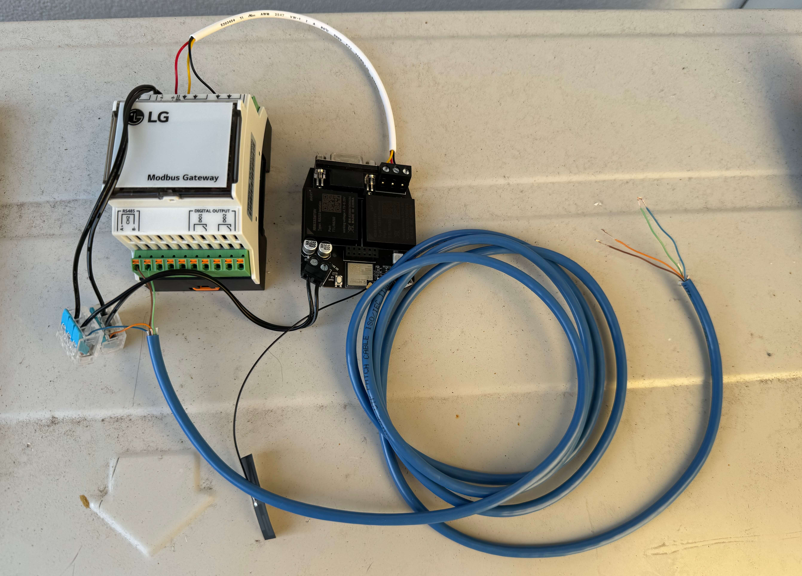

## Disclaimer
This whole exercise has been for my own personal learning and experimentation. There are aspects of integrating with high voltage equipment and looking into unpublished protocols. Attempting anything detailed here is at your own risk, may void the warranty of your unit or worse may result in physical harm.

 

## Introduction

This journey started with a need to surface my LG Multi-V S heatpump locally (IE, no cloud connection) within Home Assistant.

 

### Inspiration

I found an amazing project [JanM321/esphome-lg-controller](https://github.com/JanM321/esphome-lg-controller) that essentially plugs into the indoor unit using the wall controller pins and speaks the protocol required to read/update state from the indoor unit.

I was able to confirm this would work in my use-case as I had the same wall panel (PREMTB001) and was able to capture the bytes and decode them correctly. You can read on those efforts here: [First Discussion](https://github.com/JanM321/esphome-lg-controller/issues/1#issuecomment-1636972289) and [Second Discussion](https://github.com/JanM321/esphome-lg-controller/issues/2).

While this approach worked well for me, I wanted to be able to use the original panels on the wall at the same time. Ideally I'd also like to only have a single integration instead of putting an ESP32 in the wall for each of the four zones/controllers I have.

One day [a video](https://www.youtube.com/embed/Xuj2YFZ5zME?si=3Ovf-9DifcNpapcV) pops up on my YouTube recommendations from [Rod McBain](https://www.youtube.com/@RodMcBain) detailing an approach for interfacing with an LG outdoor unit using Modbus directly. After further research I found that my unit - LG Multi-V S did not have a direct modbus interface like Rod's LG Therma V. But this was enough to set me down the path of attempting direct integration with the outdoor unit.

 

## Direct Integration Options

It turns out for many LG outdoor units there are three primary ways to enable central control:

1. **Onboard Modbus** - unfortunately for my particular unit (Multi-V S), this was not a function I could find. 

2. **Onboard Central Control pins** - some units have pins labeled Central Control or CENA and CENB. This is an RS485 interface, but speaks a custom protocol called LGAP (which seems to stand for something like LG Airconditioner Protocol). More on LGAP later, but there is no published spec that I've been able to find.

3. [**PI-485 extension board**](https://www.lgvrf.ca/en/products/pi~485) - for older units, you can use the PI-485 board which can attach to pins inside the unit and present an RS485 interface that speaks LGAP as described above.

4. [**PMBUSB00A Modbus gateway**](https://api.library.loxone.com/downloader/file/246/LG%20PMBUSB00A%20%20Installation%20guide.pdf) - this device can take the Central Control/LGAP interface and publish a set of standard modbus registers as a result. For my use case with a Multi-V S, I could in theory wire this directly to the central control pins and control it via modbus!

5. There are also other alternative units that LG provide as first party units for BMS integration using protocols such as LonWorks, BACnet and more.

 

## Starting with PMBUSB00A
I managed to source one of these gateways and wire it up to the outdoor unit. It was really easy as the [installation guide](https://api.library.loxone.com/downloader/file/246/LG%20PMBUSB00A%20%20Installation%20guide.pdf) provided plenty of detail for the wiring and the detailing of the Modbus registers. 

For the integration between the PMBUSB00A and Home Assistant, I used a [LILYGO T-RSC3](https://www.lilygo.cc/products/t-rsc3) which is an ESP32 based board with a dedicated isolated RS485 and RS232 modules onboard. Being ESP32 based means that I can flash the device with esphome and use the yaml modbus definitions to publish live entities to Home Assistant with no custom code!

The other great benefit of this setup is that both devices could be powered from the same 12v supply. On my outdoor unit, there are 12v/ground pins right next to the Central Control pins. So convenient.

After flashing with esphome with my config which you can [view here](./ref/modbus_esphome.yaml), I successfully had entities showing in Home Assistant and they're fully compatible with automations and scenes! Keep in mind at this stage, it is not presenting a native Climate entity, but this is great progress.

You'll notice the temperatures haven't been normalised in that screenshot - they are done this way in modbus to account for decimals. You need to divide by 10 to receive the decimal value in degrees celsius.

 

## Going direct with LGAP

Once I had the modbus gateway + esphome setup, I was pretty happy. I had a solution that allowed the wall panels to operate while still having immediate control (plus automations) through Home Assistant. 

**But... what if we could avoid the modbus gateway altogether and speak the LGAP protocol directly instead?**

I went into searching as much as I possibly could about the protocol. There are really limited amounts of information available publicly. But the fact that these gateways exist (including 3rd party ones from Intesis), tells me that the protocol can be reverse engineered. 

**New goal: build a driver for esphome that uses LGAP to communicate directly and presents a standard climate entity to Home Assistant.**

What we do know from public about LGAP information is the following:

|Name|Value|
|-------|-------|
|Interface|RS485|
|Baud Rate| 4,800 bps|
|Data Bits| 8 bits|
|Parity| No Parity|
|Stop Bits| 1 stop bit|
|Request Length| 8 bytes|
|Response Length| 16 bytes|

 

I like the way that [@JanM321](https://github.com/JanM321) laid out the protocol in the method mentioned in inspiration. I will follow a similar pattern in this repo.

## [LGAP Protocol](./protocol.md)

I've done my best to document my findings so far and collated them into this page [here](./protocol.md). There's plenty more detail and I'm welcoming contributions.

* [LGAP Request](./protocol.md#lgap-request)
* [LGAP Response](./protocol.md#lgap-response)

If you have additional insight into how I can best decode these messages - I'm more than happy to accept advice or contributions. I'm sharing what I have so far so that we can build out a native integration for Home Assistant.

Enjoy!
